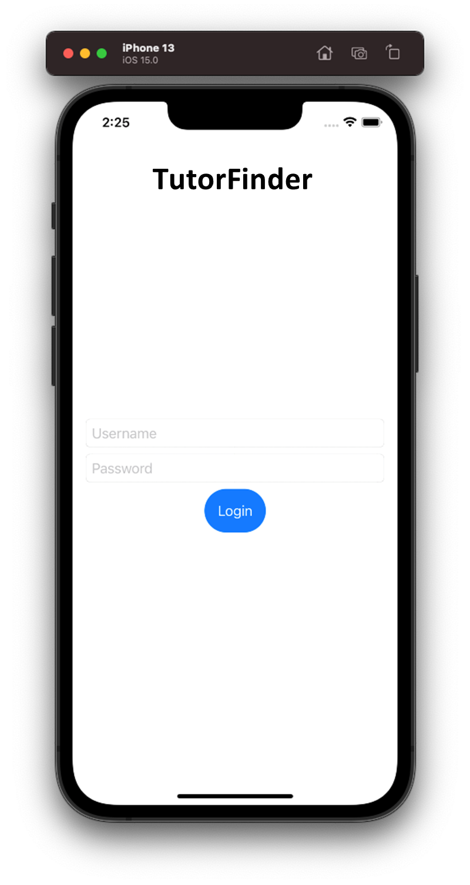
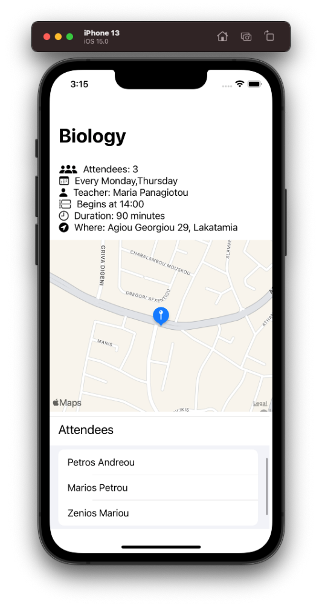
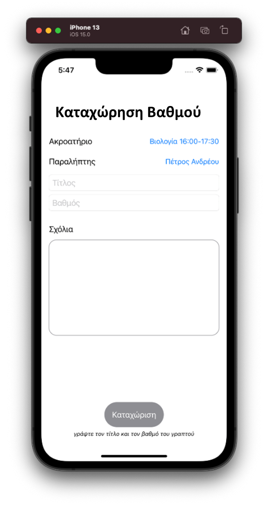
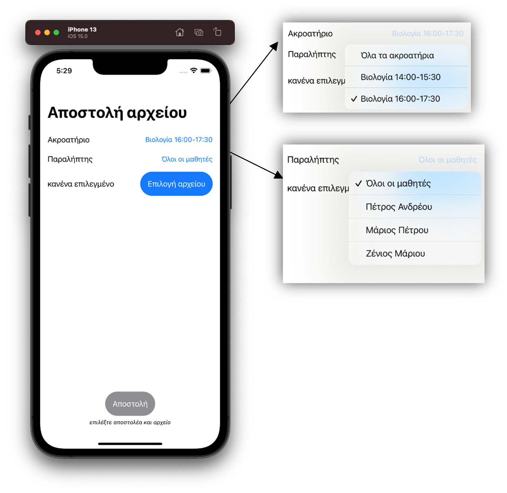
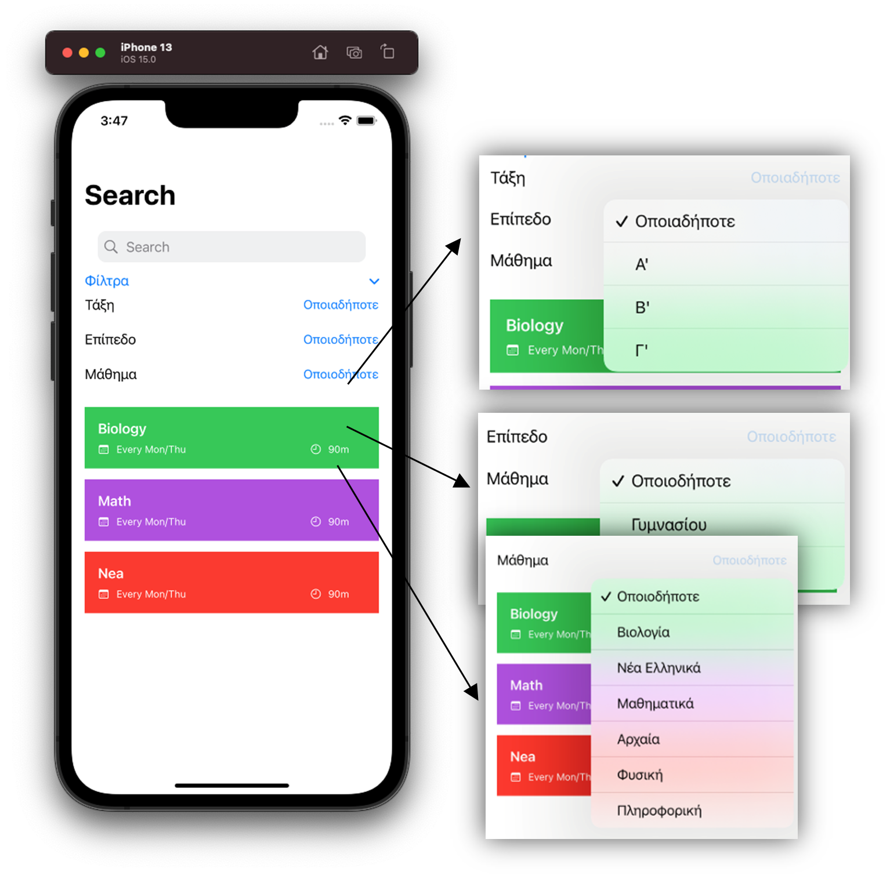
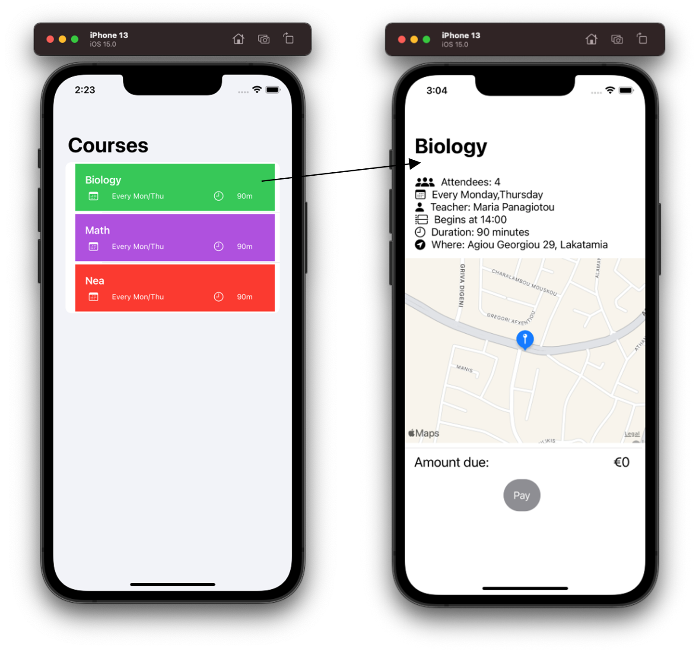
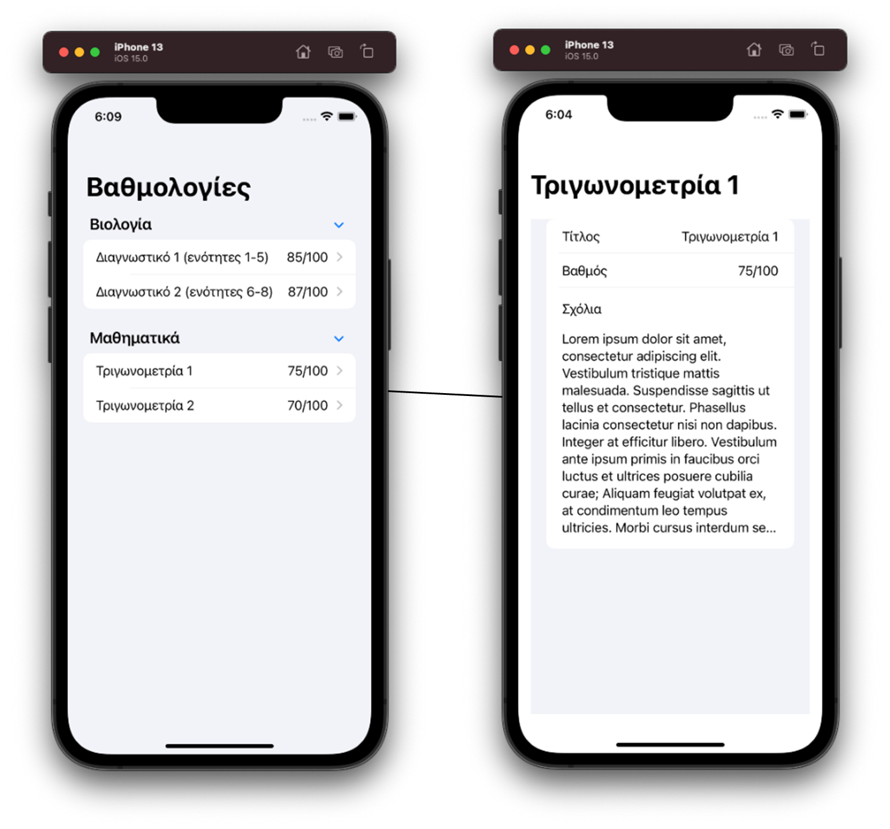

## epl343.winter21.team10

Cloned project from: https://github.com/CS-UCY-EPL343/epl343.winter21.team10.git

# TutorFinder

TutorFinder is a convenient mobile application developed to make the process of finding and registering with a tutor as simple as possible. In addition, the app can be used as a class managing tool from which tutors can organize their classrooms and students can keep track of class schedules, lecture notes, and assignments

## Getting Started

In the current phase of the applications development, a device with iOS 15.0 and later is required as well as a machine with Xcode for deployment.

##Building & Installing
1. Clone the repository
2. Open the .xcodeproj file
3. Choose your run target and click the 'play' icon on the top-left corner of the Xcode window. Voilà!

## Features

### General Features:

1. Sign in

2. Registration

### Teacher features:

1. Course creation
2. Course view
3. Classroom creation 
4. Classroom view

5. Grade assignment

6. File sharing

### Student features:

1. Course search

2. Course registration

3. Grades view

4. Calendar view
5. Teacher rating & review

## Built with

* [Swift](https://developer.apple.com/swift/) 
* [iOS Data Flow in SwiftUI](https://developer.apple.com/documentation/swiftui/state-and-data-flow)
* [Firebase Realtime Database](https://firebase.google.com/docs/reference/swift/firebasedatabase/api/reference/Classes)
* [Firebase Authentication ](https://firebase.google.com/docs/reference/swift/firebaseauth/api/reference/Classes)
* [Firebase Firestore](https://firebase.google.com/docs/reference/swift/firebasefirestore/api/reference/Classes)

## Authors

* Andreas Loizides
* Andreas Pattichis
* Leonidas Lampiritis
* Sotiris Zenios
* Christos Eleftheriou
*  Christos Kasoulides

## License
This project is licensed under the [MIT Licence](https://choosealicense.com/licenses/mit/) 
